<div align="center">



<a href="https://github.com/chrisudf">
  
</a>

<br/>


<a href="https://github.com/chrisudf?tab=followers"></a>


</div>

## `> whoami`

<table width="100%">
<tr>
<td width="50%" valign="top">

```yaml
handle:    Nomad
name:      Chris Qiu / 邱骋
role:      builds quant tooling & AI agents
base:      Brisbane, AU  ·  UTC+10
langs:     Python · TypeScript · Pine Script
stack:     FastAPI · Next.js · pandas · IBKR API
runtime:   Claude Code, always-on
doctrine:  "automate the boring, trade the rest"
```

</td>
<td width="50%" valign="top">

**Currently jacked into —**

- `[■■■■■■■□□□]` options **vol surface** scanners — earnings IV crush, forward vol
- `[■■■■■□□□□□]` **AU tax automation** — CGT working papers straight from IBKR
- `[■■■■■■□□□□]` **SEC → DCF** pipelines for US equity valuation
- `[■■■□□□□□□□]` a bilingual **AI implementation studio** for local SMBs

</td>
</tr>
</table>

<div align="center">



<sub><i>self-hosted — regenerated nightly by a workflow in this repo, so it never 503s</i></sub>

</div>

<div align="center"></div>

## `> ls ./deployed`

<table width="100%">
<tr>
<td width="50%" valign="top">

### ⟢ [earnings-iv-scanner](https://github.com/chrisudf/earnings-iv-scanner)

Screens pre-earnings implied-vol crush across the options chain and ranks the setups worth taking.

`Python` `pandas` `cron` `DigitalOcean`

</td>
<td width="50%" valign="top">

### ⟢ [forward-volatility-calculator](https://github.com/chrisudf/forward-volatility-calculator)

Strips out the event vol between two expiries so you know what you're *actually* paying for.

`Python` `numpy` `options`

</td>
</tr>
<tr>
<td valign="top">

### ⟢ [ibkr-tax-report](https://github.com/chrisudf/ibkr-tax-report)

Australian CGT working papers from IBKR statements — FIFO lot matching, RBA daily FX, CSV/PDF/ZIP. Runs fully local.

`Python` `ATO` `FIFO` `offline`

</td>
<td valign="top">

### ⟢ [sec-filing-downloader](https://github.com/chrisudf/sec-filing-downloader)

批量拉取 SEC EDGAR 的 10-K/10-Q/20-F/6-K 并自动重命名，为 DCF / PE 估值备料。

`Python` `FastAPI` `EDGAR`

</td>
</tr>
<tr>
<td valign="top">

### ⟢ [ai-investment-agent](https://github.com/chrisudf/ai-investment-agent)

An agent that reads the filings, runs the numbers, and argues with itself before it says buy.

`Python` `LLM` `agents`

</td>
<td valign="top">

### ⟢ [cq-portfolio](https://github.com/chrisudf/cq-portfolio)

Cyberpunk-themed freelance & consulting portfolio. Yes, this is a whole aesthetic.

`Next.js` `TypeScript` `Tailwind`

</td>
</tr>
</table>

<div align="center"></div>

## `> cat /proc/arsenal`

<div align="center">


<br/>


<br/><br/>


</div>

<div align="center"></div>

## `> run snake --eat=contributions`

<div align="center">

<picture>
  <source media="(prefers-color-scheme: dark)"  srcset="https://raw.githubusercontent.com/chrisudf/chrisudf/output/snake-neon.svg">
  <source media="(prefers-color-scheme: light)" srcset="https://raw.githubusercontent.com/chrisudf/chrisudf/output/snake-neon.svg">
  
</picture>

<br/>


</div>

<div align="center"></div>

## `> netrunner --connect`

<div align="center">

<a href="mailto:chengqiu03@gmail.com"></a>
<a href="https://github.com/chrisudf"></a>

<br/><br/>

<details>
<summary><b><code>[ decrypt // 解密 ]</code></b></summary>

<br/>

```console
$ ./contact --handshake
[  OK  ] resolving chrisudf.dev ......... 200
[  OK  ] negotiating ICE ................ passed
[  OK  ] timezone ....................... UTC+10 (Brisbane)
[ WARN ] replies slow during US market hours
[  OK  ] open to: quant tooling · AI automation · AU/CN bilingual builds

> "The street finds its own uses for things."
```

</details>

<br/>


<sub><code>// no gods, no kings, only merge commits</code></sub>

</div>
